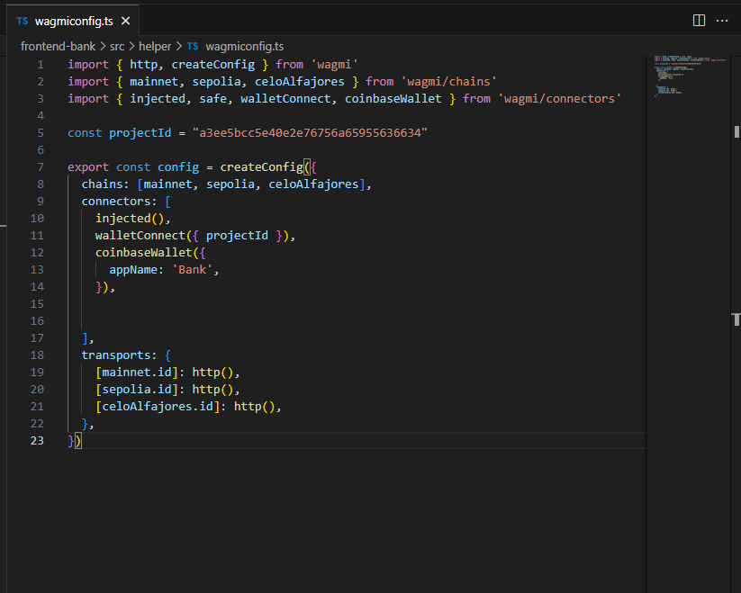
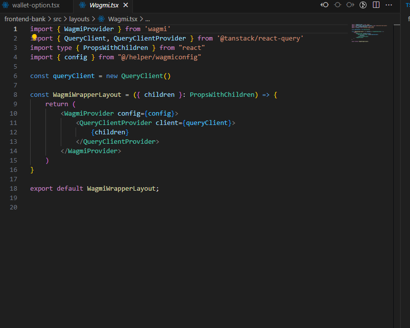
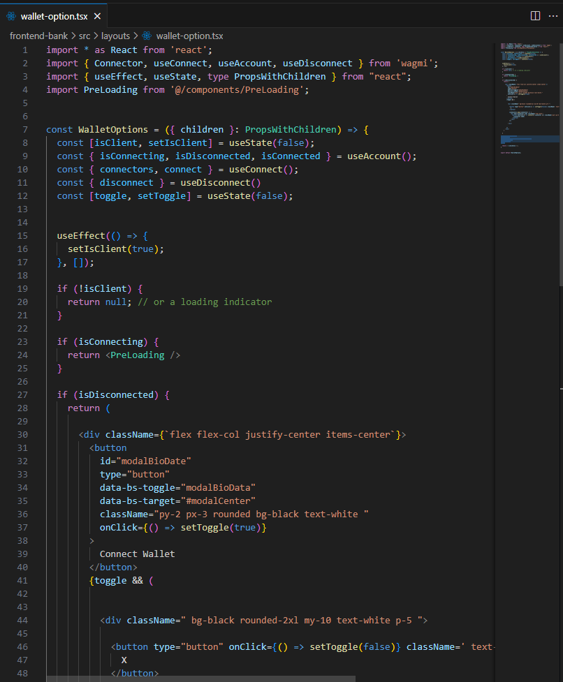

## Intrduction 
 
We implemented the new Wagmi library from [https://wagmi.sh/core/installation](https://wagmi.sh/core/installation )
User can connect to three EVM networks which are the mainnet(Ethereum), sepolia(Ethereum), and celoAlfajores.

Wallet can be connected through MetaMask, CoinbaseWallet, WalletConnect and Injected network.

##  To set up the wallet connection 


**We setup the wagmi config to specify the configuration wallets we want to connect connect.**

    - Injected wallet - To prompt any injected wallet to connect
    - WalletConnect
    - CoinbaseWallet
    - MetaMask




**We setup a wagmi wrapper layout to wrapped every components or pages that we want to setup wallet connet options**
    



**We setup our wagmi connect wallet status options for every action your wallet is performing such as connecting, isconnecting disconnect and other status as well** 




## Getting Started

First, run the development server:

```
cd frontend-bank 
```

``` 
yarn  
```


```bash
npm run dev
# or
yarn dev
# or
pnpm dev
# or
bun dev
```

You can find the contract inside the cntract folder

```
cd contract
```


Open [http://localhost:3000](http://localhost:3000) with your browser to see the result.
